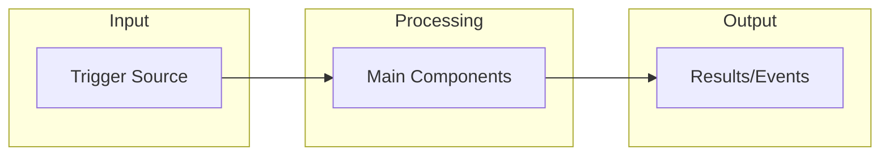
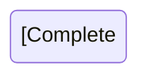

# Sub-Agent Code Documenter Command

Generates comprehensive, semantic documentation by performing deep multi-phase analysis of system architecture, data models, business logic, error handling, CI/CD pipelines, testing strategies, security, and observability. Produces thorough documentation with Mermaid diagrams for every major component.

## Command Syntax

```bash
sub-agent-code-documenter [target] [options]

# Aliases
@document [target] [options]
@doc-gen [target] [options]
@sacd [target] [options]
```

## Parameters

- `target` - Directory to analyze (defaults to current directory)
- `--output` - Output directory for documentation (default: ./docs)
- `--name` - Project name for documentation headers
- `--format` - Output format (markdown, html, confluence)
- `--diagrams` - Diagram format (mermaid, plantuml, ascii)
- `--depth` - Analysis depth (quick, standard, deep)
- `--focus` - Focus areas (all, architecture, data, logic, errors, cicd, testing, security)
- `--include-code` - Include code snippets in documentation
- `--skip` - Skip specific analyzers (comma-separated)

## Examples

```bash
# Full comprehensive documentation
@document

# Deep analysis with project name
@doc-gen /path/to/project --name "GMS Consent Checking" --depth deep

# Focus on specific areas
@document src/ --focus architecture,testing --diagrams mermaid

# Skip CI/CD analysis for projects without pipelines
@document --skip cicd
```

## Output Documents

The command generates 8 comprehensive documents:

| Document | Purpose |
|----------|---------|
| **OVERVIEW.md** | System purpose, key components, technology stack, quick reference |
| **ARCHITECTURE.md** | System diagrams, component relationships, infrastructure, data flow |
| **DATA_MODELS.md** | Database schemas, model definitions, relationships, field meanings |
| **BUSINESS_LOGIC.md** | Processing rules, validation logic, thresholds, flow diagrams for each handler |
| **ERROR_HANDLING.md** | Retry configs, DLQs, failure events, recovery procedures |
| **CICD.md** | Pipeline documentation, deployment process, environments, build steps |
| **TESTING.md** | Test coverage, test patterns, what's tested, mock strategies |
| **SECURITY_OBSERVABILITY.md** | IAM, secrets, logging, metrics, alarms, tracing |

---

## Phase 1: Tech Stack Discovery Agent

```
Discover technology stack and map all relevant files in [TARGET]

This agent runs FIRST to determine which subsequent analyzers are relevant.

Tasks:
1. Language Detection:
   - Python (*.py, requirements.txt, setup.py, pyproject.toml, Pipfile)
   - JavaScript/TypeScript (*.js, *.ts, package.json, tsconfig.json)
   - Go (*.go, go.mod, go.sum)
   - Java (*.java, pom.xml, build.gradle)
   - Rust (*.rs, Cargo.toml)
   - Ruby (*.rb, Gemfile)
   - PHP (*.php, composer.json)

2. Infrastructure Detection:
   - Terraform (*.tf, *.tfvars)
   - CloudFormation (template.yaml, template.json with AWSTemplateFormatVersion)
   - CDK (cdk.json, *.ts with aws-cdk imports)
   - Serverless Framework (serverless.yml, serverless.yaml)
   - SAM (template.yaml with AWS::Serverless)
   - Pulumi (Pulumi.yaml)
   - Kubernetes (*.yaml with apiVersion: v1, kind: Deployment, etc.)
   - Docker (Dockerfile, docker-compose.yml)

3. CI/CD Detection:
   - GitHub Actions (.github/workflows/*.yml)
   - GitLab CI (.gitlab-ci.yml)
   - Jenkins (Jenkinsfile)
   - CircleCI (.circleci/config.yml)
   - Travis CI (.travis.yml)
   - Azure DevOps (azure-pipelines.yml)
   - AWS CodePipeline (buildspec.yml, appspec.yml)
   - Bitbucket Pipelines (bitbucket-pipelines.yml)

4. Testing Framework Detection:
   - Python: pytest (pytest.ini, conftest.py, test_*.py), unittest
   - JavaScript: Jest (jest.config.js), Mocha, Vitest, Cypress, Playwright
   - Go: *_test.go files
   - Java: JUnit, TestNG
   - Integration tests directories (tests/, __tests__/, spec/, e2e/)

5. Database/Storage Detection:
   - DynamoDB (terraform aws_dynamodb_table, boto3 dynamodb)
   - PostgreSQL/MySQL (SQLAlchemy, psycopg2, mysql-connector)
   - MongoDB (pymongo, mongoose)
   - Redis (redis-py, ioredis)
   - S3 (boto3 s3, @aws-sdk/client-s3)

6. API Framework Detection:
   - FastAPI, Flask, Django (Python)
   - Express, NestJS, Fastify (Node.js)
   - Gin, Echo, Fiber (Go)
   - Spring Boot (Java)
   - OpenAPI specs (openapi.yaml, swagger.json)
   - GraphQL schemas (*.graphql, schema.graphql)

7. Cloud Provider Detection:
   - AWS (boto3, @aws-sdk, terraform aws_*)
   - GCP (google-cloud-*, terraform google_*)
   - Azure (azure-*, terraform azurerm_*)

Return:
- Complete technology stack inventory
- File inventory categorized by type with full paths
- Relevant analyzers to run (skip irrelevant ones)
- Project structure type (monorepo, single service, library)
- Entry points identified
```

---

## Phase 2: Analysis Agents (Run in Parallel)

### Agent A1: Infrastructure Analyzer

```
Analyze ALL infrastructure definitions in [TARGET] using discovered files: [DISCOVERY_RESULTS]

Tasks:
1. Compute Resources (document EVERY resource found):
   For each Lambda/Function:
   - Function name
   - Runtime and version
   - Handler path (actual file location)
   - Memory allocation
   - Timeout configuration
   - Environment variables (names, not values)
   - VPC configuration if any
   - Layers attached
   - Concurrency limits

   For ECS/EKS/Containers:
   - Service definitions
   - Task definitions
   - Container specifications
   - Resource limits

2. Orchestration (CRITICAL - extract ALL details):
   For Step Functions:
   - State machine name
   - COMPLETE state machine definition (parse the JSON/YAML)
   - Every state with its type (Task, Parallel, Choice, Wait, etc.)
   - For Parallel states: list ALL branches and what they do
   - For each Task state: which Lambda it invokes
   - For Choice states: the conditions and branching logic
   - Retry configurations for EVERY state:
     * ErrorEquals (which errors)
     * IntervalSeconds
     * MaxAttempts
     * BackoffRate
   - Catch configurations for EVERY state:
     * ErrorEquals
     * Next state
     * ResultPath
   - Timeout configurations

   For EventBridge:
   - Rule names and descriptions
   - Event patterns (exact JSON)
   - Targets (Lambda, SQS, SNS, etc.)
   - Schedules if any

   For SQS:
   - Queue names
   - Visibility timeout
   - Message retention
   - DLQ configuration (which queue, maxReceiveCount)
   - Encryption settings

3. Storage (document EVERY table/bucket):
   For DynamoDB:
   - Table name
   - Partition key (name and type)
   - Sort key (name and type) if exists
   - ALL Global Secondary Indexes:
     * Index name
     * Partition key
     * Sort key
     * Projection type
   - ALL Local Secondary Indexes
   - Stream configuration (enabled, view type)
   - TTL configuration (attribute name)
   - Billing mode
   - Point-in-time recovery

   For S3:
   - Bucket name
   - Event notifications (which events trigger what)
   - Lifecycle rules
   - Versioning
   - Encryption

4. Networking:
   - VPCs and subnets
   - Security groups (inbound/outbound rules)
   - API Gateway configurations
   - Load balancers
   - CloudFront distributions

Generate Mermaid Diagram:
- Create a complete infrastructure diagram showing ALL resources
- Show connections between resources (triggers, invocations)
- Group by service type (Compute, Storage, Orchestration)

Return:
- Complete infrastructure inventory with ALL details
- Resource relationship mapping
- Mermaid infrastructure diagram
- Configuration values table (timeouts, memory, thresholds)
```

### Agent A2: Data Model Analyzer

```
Analyze ALL data models and schemas in [TARGET] using discovered files: [DISCOVERY_RESULTS]

Tasks:
1. Database Schemas (document EVERY table):
   For each DynamoDB table:
   - Table purpose (infer from name and usage)
   - Primary key design pattern (e.g., PK=USER#id, SK=ORDER#timestamp)
   - Access patterns supported (what queries can be done)
   - ALL attributes used (scan handler code for attribute names)
   - Example item structure (construct from code analysis)
   - Relationships to other tables

   For SQL databases:
   - All tables with columns
   - Data types
   - Constraints (primary key, foreign key, unique, not null)
   - Indexes
   - Relationships (ERD)

2. Application Models (document EVERY model class):
   For Pydantic models:
   - Class name and purpose
   - ALL fields with:
     * Field name
     * Type (including Optional, List, etc.)
     * Default value if any
     * Validation rules (Field constraints, validators)
     * Description from docstring or Field(description=)
   - Inheritance hierarchy
   - Config class settings

   For dataclasses:
   - Same detail level as Pydantic

   For TypeScript interfaces:
   - Interface name
   - All properties with types
   - Optional vs required

3. Data Transformations:
   - How data flows between models
   - Serialization/deserialization patterns
   - Data mapping between layers

4. Validation Rules:
   - Field-level validation
   - Cross-field validation
   - Business rule validation

Generate Mermaid Diagrams:
- Entity Relationship Diagram (ERD) for all data models
- Data flow diagram showing transformations

Return:
- Complete schema documentation
- Model documentation with all fields
- Mermaid ERD diagram
- Mermaid data flow diagram
- Validation rules catalog
```

### Agent A3: Business Logic Analyzer

```
Analyze ALL business logic in [TARGET] using discovered files: [DISCOVERY_RESULTS]

CRITICAL: For EVERY handler/function, generate a Mermaid flowchart showing its logic.

Tasks:
1. Handler Analysis (for EVERY Lambda/handler/controller):
   Document:
   - Function name and file location
   - Purpose (what business problem does it solve?)
   - Input: Event/request structure with all fields
   - Processing steps in order (numbered list)
   - External calls made (other services, databases, APIs)
   - Output: Response structure
   - Side effects (what data is modified?)

   Generate Mermaid flowchart:
   ```
   flowchart TD
       A[Receive Event] --> B{Validate Input}
       B -->|Valid| C[Step 1: Description]
       B -->|Invalid| Z[Return Error]
       C --> D[Step 2: Description]
       ...
   ```

2. Validation Rules (extract ALL):
   - Input validation (what makes input invalid?)
   - Business rule validation
   - Data format requirements
   - Required vs optional fields
   - Value constraints (min, max, regex, enum values)

3. Success/Failure Criteria (EXACT values):
   - What determines success? (exact conditions)
   - What determines failure? (exact conditions)
   - Confidence thresholds (find the EXACT numbers in code)
   - Score calculations (the actual formulas)
   - Status determination logic (the actual if/else conditions)

4. Magic Numbers and Constants:
   Find and document EVERY:
   - Threshold value (e.g., confidence >= 0.90)
   - Timeout value
   - Retry count
   - Batch size
   - Rate limit
   - Buffer size
   - Any hardcoded number with business meaning

5. Decision Points:
   - Document every if/else, switch/case
   - What conditions lead to what outcomes?
   - Edge cases handled

6. Processing Patterns:
   - Sequential processing
   - Parallel processing
   - Batch processing
   - Stream processing
   - Pub/sub patterns

Generate Mermaid Diagrams:
- Flowchart for EACH handler showing complete logic
- Decision tree for complex branching logic
- Sequence diagram for multi-service interactions
- State diagram for stateful processing

Return:
- Handler documentation with Mermaid flowcharts for EACH
- Validation rules catalog
- Success criteria with exact thresholds
- Magic numbers inventory with context
- Decision point documentation
```

### Agent A4: Error Handling Analyzer

```
Analyze ALL error handling patterns in [TARGET] using discovered files: [DISCOVERY_RESULTS]

Tasks:
1. Step Function Error Handling:
   For EVERY state with Retry:
   - State name
   - Errors caught (ErrorEquals)
   - Retry configuration:
     * IntervalSeconds (exact value)
     * MaxAttempts (exact value)
     * BackoffRate (exact value)
   - What happens after max retries?

   For EVERY state with Catch:
   - State name
   - Errors caught (ErrorEquals)
   - Next state on error
   - ResultPath configuration

2. Application-Level Error Handling:
   - Try/except patterns (what exceptions are caught?)
   - Custom exception classes defined
   - Error response formats
   - Error codes used

3. Dead Letter Queues:
   - Which queues have DLQs?
   - DLQ queue names
   - maxReceiveCount values
   - What happens to DLQ messages? (processing logic if any)
   - Alerting on DLQ?

4. Failure Events:
   - What events are emitted on failure?
   - Event structure (exact fields)
   - Event bus/topic destinations
   - Who consumes failure events?

5. Circuit Breaker Patterns:
   - Any circuit breaker implementations?
   - Timeout handling
   - Fallback behaviors

6. Recovery Procedures:
   - Manual intervention points
   - Automatic recovery mechanisms
   - Idempotency handling (how are retries made safe?)
   - State recovery patterns

7. Logging on Errors:
   - What gets logged on error?
   - Log levels used
   - Error context captured

Generate Mermaid Diagrams:
- Error flow diagram showing all error paths
- Retry sequence diagram
- DLQ flow diagram

Return:
- Complete retry configuration table
- Catch configuration table
- DLQ configuration documentation
- Failure event catalog
- Error handling flow diagram
- Recovery procedure documentation
```

### Agent A5: CI/CD Pipeline Analyzer

```
Analyze ALL CI/CD configurations in [TARGET] using discovered files: [DISCOVERY_RESULTS]

Tasks:
1. Pipeline Structure:
   For GitHub Actions:
   - Workflow file names and purposes
   - Trigger events (push, pull_request, schedule, workflow_dispatch)
   - Jobs and their dependencies
   - Steps in each job
   - Environment variables and secrets used
   - Artifacts produced
   - Caching configuration

   For GitLab CI:
   - Stages defined
   - Jobs in each stage
   - Rules/conditions for job execution
   - Variables and secrets

   For Other CI systems:
   - Same level of detail

2. Build Process:
   - Build commands
   - Dependencies installed
   - Build artifacts
   - Docker image builds
   - Asset compilation

3. Test Execution:
   - Which tests run in CI?
   - Test commands
   - Coverage requirements
   - Test parallelization

4. Deployment Process:
   - Deployment targets (environments)
   - Deployment method (Terraform, SAM, CDK, kubectl, etc.)
   - Deployment order
   - Rollback procedures
   - Approval gates

5. Environment Configuration:
   - Environment names (dev, staging, prod)
   - Environment-specific variables
   - Promotion process between environments

6. Quality Gates:
   - Linting checks
   - Security scanning
   - Code coverage thresholds
   - Required status checks

Generate Mermaid Diagrams:
- Pipeline flow diagram showing all stages/jobs
- Deployment flow diagram
- Environment promotion diagram

Return:
- Complete pipeline documentation
- Build process documentation
- Deployment process documentation
- Environment configuration matrix
- Mermaid pipeline diagram
```

### Agent A6: Testing Analyzer

```
Analyze ALL testing in [TARGET] using discovered files: [DISCOVERY_RESULTS]

Tasks:
1. Test Inventory:
   - Count of test files
   - Count of test functions/cases
   - Test file locations and organization
   - Test naming conventions used

2. Test Types Present:
   Unit Tests:
   - Which modules have unit tests?
   - Which modules are MISSING unit tests?
   - Test patterns used (AAA, Given-When-Then)

   Integration Tests:
   - What integrations are tested?
   - Test databases/mocks used
   - External service mocking

   End-to-End Tests:
   - E2E test scenarios
   - Test environment setup

   Other Tests:
   - Performance tests
   - Contract tests
   - Snapshot tests

3. Test Coverage Analysis:
   - Look for coverage configuration
   - Coverage thresholds if defined
   - Which areas have good coverage?
   - Which areas are undertested?

4. Mock Strategies:
   - What's being mocked?
   - Mock libraries used
   - Fixture patterns
   - Test data factories

5. Test Configuration:
   - Test runner configuration
   - Plugins/extensions used
   - Custom test utilities
   - Setup/teardown patterns

6. Test Quality:
   - Are tests testing behavior or implementation?
   - Assertion patterns
   - Test isolation
   - Flaky test indicators

Generate Documentation:
- Test coverage matrix (what's tested vs what's not)
- Test patterns guide
- Mock inventory

Return:
- Test inventory with counts
- Coverage analysis
- Test pattern documentation
- Mock strategy documentation
- Gaps in testing (what's NOT tested)
```

### Agent A7: Security & Observability Analyzer

```
Analyze security and observability in [TARGET] using discovered files: [DISCOVERY_RESULTS]

Tasks:
1. IAM and Permissions:
   - IAM roles defined
   - Permissions granted (policy documents)
   - Least privilege analysis
   - Cross-account access

2. Secrets Management:
   - How are secrets stored? (SSM, Secrets Manager, env vars)
   - Secret references in code
   - Secret rotation configuration

3. Network Security:
   - Security group rules
   - VPC configuration
   - Private/public subnet usage
   - WAF rules if any

4. Authentication/Authorization:
   - Auth mechanisms (Cognito, IAM, API keys)
   - Authorization patterns
   - Token validation

5. Logging:
   - What gets logged?
   - Log destinations (CloudWatch, S3, etc.)
   - Log format/structure
   - Log levels configured
   - Sensitive data in logs?

6. Metrics:
   - Custom metrics defined
   - CloudWatch metrics used
   - Metric dimensions
   - Dashboard configurations

7. Alarms:
   - CloudWatch alarms defined
   - Alarm thresholds
   - Notification targets (SNS, PagerDuty, etc.)
   - What conditions trigger alerts?

8. Tracing:
   - X-Ray enabled?
   - Trace sampling configuration
   - Custom segments/subsegments

Generate Documentation:
- Security configuration summary
- Logging and metrics inventory
- Alarm configuration table

Return:
- IAM documentation
- Secrets management documentation
- Logging documentation
- Metrics and alarms documentation
- Security recommendations
```

---

## Phase 3: Synthesis Agent

```
Synthesize ALL analysis results into coherent, comprehensive documentation: [ALL_ANALYSIS_RESULTS]

Tasks:
1. Cross-Reference Validation:
   - Ensure all Lambdas mentioned in Step Functions exist
   - Ensure all DynamoDB tables referenced in code are documented
   - Ensure all event sources have corresponding handlers
   - Flag any inconsistencies

2. Gap Analysis:
   - What areas couldn't be analyzed? (document limitations)
   - What additional information would be helpful?
   - What assumptions were made?

3. Document Organization:
   - Logical flow between sections
   - Consistent terminology throughout
   - Cross-references between documents
   - Table of contents for each document

4. Diagram Consistency:
   - Consistent styling across all Mermaid diagrams
   - Proper labeling and legends
   - Appropriate level of detail

5. Executive Summary:
   - Key findings
   - Architecture highlights
   - Critical business rules
   - Main risk areas

Generate:
- Coherent documentation set
- Cross-document navigation
- Completeness verification checklist
```

---

## Phase 4: Documentation Generation Agent

```
Generate final documentation files with comprehensive Mermaid diagrams: [SYNTHESIS_RESULTS]

Requirements for ALL documents:
- Use ACTUAL names from code (never generic placeholders)
- Include EXACT threshold values
- Include EXACT field names
- Include Mermaid diagrams where specified
- Consistent markdown formatting
- Clear section headings with table of contents

---

### 1. OVERVIEW.md Structure:

# [Project Name]

## Table of Contents

## Executive Summary
[2-3 paragraphs: what is this system, why does it exist, what problem does it solve]

## System at a Glance



## Key Components

| Component | Type | Purpose | Location |
|-----------|------|---------|----------|
| [Actual names from code] |  |  |  |

## Technology Stack

| Category | Technology | Version |
|----------|------------|---------|
| Language | | |
| Infrastructure | | |
| Database | | |
| CI/CD | | |

## Quick Reference

### Key Thresholds
| Threshold | Value | Purpose |
|-----------|-------|---------|
| [from code] | | |

### Key Endpoints/Entry Points
| Entry Point | Trigger | Purpose |
|-------------|---------|---------|

---

### 2. ARCHITECTURE.md Structure:

# Architecture

## Table of Contents

## System Architecture Diagram

```mermaid
flowchart TB
    [Complete system diagram with ALL components]
```

## Component Details

### [Component Category 1: e.g., Step Function Orchestration]

#### State Machine: [name]



**States:**
| State | Type | Purpose | Retry Config | Catch Config |
|-------|------|---------|--------------|--------------|

**Parallel Branches:**
[Document each parallel branch]

### [Component Category 2: e.g., Lambda Functions]

| Lambda | Runtime | Memory | Timeout | Handler | Purpose |
|--------|---------|--------|---------|---------|---------|

### [Component Category 3: e.g., Storage]

#### DynamoDB Tables

| Table | PK | SK | GSIs | Streams | Purpose |
|-------|----|----|------|---------|---------|

## Data Flow

```mermaid
sequenceDiagram
    [Show data flow through system]
```

## Integration Points

| Source | Target | Protocol | Purpose |
|--------|--------|----------|---------|

---

### 3. DATA_MODELS.md Structure:

# Data Models

## Table of Contents

## Entity Relationship Diagram

```mermaid
erDiagram
    [Complete ERD]
```

## Database Tables

### [Table Name]

**Purpose:** [What this table stores]

**Key Schema:**
- Partition Key: `[name]` ([type])
- Sort Key: `[name]` ([type]) [if exists]

**Access Patterns:**
| Pattern | Key Condition | Use Case |
|---------|---------------|----------|

**Attributes:**
| Attribute | Type | Required | Description |
|-----------|------|----------|-------------|

**Global Secondary Indexes:**
| Index Name | PK | SK | Projection | Use Case |
|------------|----|----|------------|----------|

**Example Item:**
```json
{
  [realistic example]
}
```

## Application Models

### [Model Class Name]

**Purpose:** [What this model represents]

**Fields:**
| Field | Type | Required | Default | Validation | Description |
|-------|------|----------|---------|------------|-------------|

**Relationships:**
[How this model relates to others]

---

### 4. BUSINESS_LOGIC.md Structure:

# Business Logic

## Table of Contents

## Processing Overview

```mermaid
flowchart TD
    [High-level processing flow]
```

## Handler Documentation

### [Handler Name 1]

**Location:** `[file path]`
**Trigger:** [What triggers this handler]
**Purpose:** [What business problem it solves]

#### Flow Diagram

```mermaid
flowchart TD
    A[Receive Event] --> B{Validation}
    B -->|Valid| C[Step 1]
    [Complete flow]
```

#### Input
```json
{
  [Input structure with all fields]
}
```

#### Processing Steps
1. **[Step Name]**: [Description]
2. **[Step Name]**: [Description]
...

#### Output
```json
{
  [Output structure]
}
```

#### Validation Rules
| Rule | Condition | Error |
|------|-----------|-------|

#### Thresholds Used
| Threshold | Value | Purpose |
|-----------|-------|---------|

[REPEAT FOR EVERY HANDLER]

## Business Rules

### [Rule Category 1]

| Rule | Condition | Outcome |
|------|-----------|---------|

## Success Criteria

### [Outcome 1: e.g., "Valid Consent"]
Conditions (ALL must be true):
- [ ] [Exact condition 1]
- [ ] [Exact condition 2]

### [Outcome 2: e.g., "Invalid Consent"]
Conditions (ANY triggers this):
- [ ] [Exact condition 1]

## Constants and Magic Numbers

| Constant | Value | Location | Purpose |
|----------|-------|----------|---------|

---

### 5. ERROR_HANDLING.md Structure:

# Error Handling

## Table of Contents

## Error Flow Overview

```mermaid
flowchart TD
    [Show all error paths]
```

## Retry Configuration

### Step Function Retries

| State | Errors | Interval | Max Attempts | Backoff | Final Action |
|-------|--------|----------|--------------|---------|--------------|

### Application Retries

| Operation | Retry Strategy | Max Attempts | Backoff |
|-----------|----------------|--------------|---------|

## Catch Configuration

| State | Errors Caught | Next State | ResultPath |
|-------|---------------|------------|------------|

## Dead Letter Queues

```mermaid
flowchart LR
    [DLQ flow diagram]
```

| Source Queue | DLQ Name | Max Receives | Processing |
|--------------|----------|--------------|------------|

## Failure Events

| Event Type | Source | Detail Type | Payload | Consumers |
|------------|--------|-------------|---------|-----------|

**Example Failure Event:**
```json
{
  [Actual event structure]
}
```

## Exception Handling

| Exception Type | Where Thrown | How Handled | User Message |
|----------------|--------------|-------------|--------------|

## Recovery Procedures

### [Scenario 1: e.g., "Textract Max Retries"]
1. [Step 1]
2. [Step 2]

---

### 6. CICD.md Structure:

# CI/CD Pipeline

## Table of Contents

## Pipeline Overview

```mermaid
flowchart LR
    [Complete pipeline visualization]
```

## Workflows/Pipelines

### [Workflow Name]

**Trigger:** [Events that trigger this workflow]
**Purpose:** [What this workflow does]

```mermaid
flowchart TD
    [Workflow stages/jobs]
```

**Jobs:**
| Job | Runs On | Depends On | Purpose |
|-----|---------|------------|---------|

**Steps in [Job Name]:**
| Step | Action | Purpose |
|------|--------|---------|

## Build Process

| Stage | Command | Artifacts |
|-------|---------|-----------|

## Test Execution

| Test Type | Command | Coverage Requirement |
|-----------|---------|---------------------|

## Deployment Process

```mermaid
flowchart TD
    [Deployment flow]
```

### Environments

| Environment | URL | Deployment Method | Approval Required |
|-------------|-----|-------------------|-------------------|

### Deployment Steps
1. [Step 1]
2. [Step 2]

## Quality Gates

| Gate | Threshold | Blocking |
|------|-----------|----------|

---

### 7. TESTING.md Structure:

# Testing

## Table of Contents

## Test Coverage Overview

| Category | Files | Test Count | Coverage |
|----------|-------|------------|----------|

## Test Matrix

| Module/Component | Unit | Integration | E2E | Notes |
|------------------|------|-------------|-----|-------|

## Test Organization

```
tests/
├── unit/
│   ├── [structure]
├── integration/
│   ├── [structure]
└── e2e/
    └── [structure]
```

## Test Patterns

### Unit Tests
- Pattern used: [AAA, Given-When-Then, etc.]
- Example:
```python
[Real test example from codebase]
```

### Integration Tests
- What's integrated: [List]
- Mocking strategy: [Description]

## Mock Inventory

| What's Mocked | Mock Type | Where Used |
|---------------|-----------|------------|

## Test Configuration

| Setting | Value | Purpose |
|---------|-------|---------|

## Testing Gaps

| Module/Function | Missing Test Type | Priority |
|-----------------|-------------------|----------|

---

### 8. SECURITY_OBSERVABILITY.md Structure:

# Security & Observability

## Table of Contents

## Security Overview

### IAM Roles

| Role | Purpose | Key Permissions |
|------|---------|-----------------|

### Secrets Management

| Secret | Storage | Rotation | Used By |
|--------|---------|----------|---------|

### Network Security

| Resource | Security Group | Inbound | Outbound |
|----------|----------------|---------|----------|

## Observability

### Logging

| Component | Log Group | Log Level | Retention |
|-----------|-----------|-----------|-----------|

### Metrics

| Metric | Namespace | Dimensions | Purpose |
|--------|-----------|------------|---------|

### Alarms

| Alarm | Metric | Threshold | Action |
|-------|--------|-----------|--------|

### Tracing

| Service | Tracing Enabled | Sampling Rate |
|---------|-----------------|---------------|

---
```

## Quality Checklist

Before completing documentation, verify:

### Completeness
- [ ] ALL Lambda functions documented with flowcharts
- [ ] ALL DynamoDB tables documented with schemas
- [ ] ALL Step Function states documented
- [ ] ALL retry configurations captured with exact values
- [ ] ALL catch blocks documented
- [ ] ALL GSIs documented
- [ ] ALL CI/CD workflows documented
- [ ] ALL test types identified

### Accuracy
- [ ] Threshold values are EXACT (from code, not approximated)
- [ ] Field names are EXACT (from code)
- [ ] File paths are correct
- [ ] Mermaid diagrams render correctly

### Diagrams
- [ ] Architecture overview diagram present
- [ ] Data flow diagram present
- [ ] Business logic flowchart for EACH handler
- [ ] Error handling flow diagram present
- [ ] CI/CD pipeline diagram present
- [ ] ERD for data models present

### Cross-References
- [ ] Links between related documents
- [ ] Table of contents in each document
- [ ] Consistent terminology

---

## Best Practices

1. **Specificity**: Use actual names, values, and thresholds from code - never generic placeholders
2. **Completeness**: Document ALL components, not a subset
3. **Diagrams**: Every major flow should have a Mermaid diagram
4. **Thresholds**: Always document exact values with context
5. **Error Paths**: Document failure scenarios as thoroughly as success paths
6. **Testing**: Be honest about what IS and IS NOT tested
7. **Gaps**: Document what couldn't be determined or requires clarification
8. **Maintainability**: Structure docs so they can be updated as code changes
